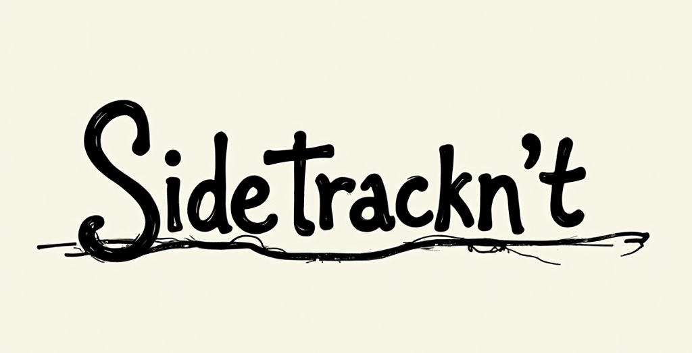

# Sidetrackn't

    

Tired of getting distracted or sidetracked on your tasks? Well me too, that's why I created this project (which by itself was a sidetrack).  
This "app" (just html lol) will play a ping + notification every X minutes to remind you to stay on track!

# Link: [sidetracknt.vercel.app](https://sidetracknt.vercel.app/)

## Audio Messages:
- Quick reminder: consider prioritization and what is "good enough for the time being".
- Stay on track. Is this the most important task to do right now?
- Refocus: what’s the main goal for this task?
- Reminder: are you working on what moves the needle?
- Check-in: is this aligned with your priorities?
- Focus: are you making progress on your core task?
- Reminder: stay sharp and aim for completion, not perfection.
- Stay on task: are you getting sidetracked?
- Refocus: what’s your top priority in this moment?
- Reminder: is this what you should be working on right now?
- Quick check: is your current effort aligned with your goals?

## Licenses & Credits:
- **This project is licensed under the [NoFreeRide License](./LICENSE).**
- [notification.wav](https://freesound.org/s/400697/) made by __Daphne_in_Wonderland__ is licensed under [CC BY 4.0](https://creativecommons.org/licenses/by/4.0/).
- [beep_up.wav](https://freesound.org/s/388046/) & [beep_down.wav](https://freesound.org/s/388046/) made by __paep3nguin__ are licensed under [CC0 1.0](https://creativecommons.org/publicdomain/zero/1.0/).
- Message audios generated by [ElevenLabs](https://elevenlabs.io/).
